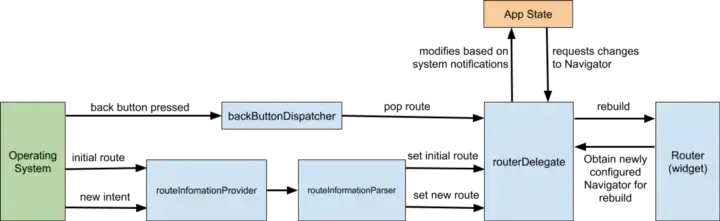

# Flutter Navigation 예제
Flutter의 다양한 네비게이션 방법을 알아보고 구현해보고 나중에 프로젝트에 적용해보자

## 1. 간략하고 넓게 네비게이션 및 라우팅 배우기
https://medium.com/flutter/learning-flutters-new-navigation-and-routing-system-7c9068155ade  

### Navigator 1.0
- Navigator - Route 객체의 스택으로 위젯을 관리
- Route - 일반적으로 MaterialPageRoute같은 클래스들로 구현된 화면을 나타내는 Navigator로 관리되는 객체  

Navigator 2.0 이전엔 Route는 네임드 혹은 익명 route의 Navigator 스택위에서 푸쉬되거나 팝되었다.  
익명이란 Navigator.push(... MaterialPageRoute(screen())) 같이 route 설정없이 그때그때 route를 만드는 것을 의미한다.  
반대로 네임드란 MaterialApp의 routes: 옵션에 Map<String, Builder> 형식으로 라우팅을 정의하고 Navigator.pushNamed('/screen') 같이 정해진 이름의 route로 이동하는 것을 말한다.  

간단하고 편하지만 문제는 둘 다 인자를 웹의 url에서 파싱할 수 없다.

### onGenerateRoute
얘는 좀더 발전해서 (settings) {} 형식으로 받으며 settings를 파싱해서 url을 분리할 수는 있다. (지금 CuteShrew Client가 쓰는 방식)

### Navigator 2.0
Navigator 2.0은 기존 프레임워크에 새로운 클래스를 추가했는데 앱의 화면을 앱 State의 기능으로 만들고 기본 플랫폼(웹의 URL 같은거)에서 경로를 파싱하는 기능을 제공한다.  

- Page - 네비게이터의 히스토리 스택을 설정하기위해 사용하는 불변 객체
- Router - 네비게이터에 의해 보여지는 페이지 리스트를 설정한다. 일반적으로 페이지 리스트들은 기본 플랫폼에서 혹은 앱 상태 변화에 따라 바뀐다.
- RouteInformationParser - RouteInformationProvider에서 RouteInformation를 가져오고 RouteInformation을 유저가 정의한 데이터 타입으로 파싱하는 역할이다.
- RouterDelegate - Router가 앱 상태의 변경 사항을 학습하는 방법과 이에 대응하는 방법에 대한 앱별 동작을 정의한다. RouterDelegate의 역할은 RouterInformationParser를 가져오고 현재 페이지 목록으로 Navigator를 구축한다.  
- BackButtonDispatcher - 뒤로가기 버튼이 눌리면 Router로 보고한다.

솔직히 이것만 보면 무슨 소리를 하는지 어렵고 그림을 보면 그나마 이해는 가능하다.

대충 예제 동작은 아래 같이 동작한다.  
1. 플랫폼에서 새로운 경로(예를 들자면 "books/2")가 발생하면, RouteInformationParser는 이 발생한 경로를 앱에서 우리가 정의했던(예시로 BooksRoutePath) 추상 데이터 T로 변환한다.
2. RouterDelete의 setNewRoutePath 메소드는 위에서 말한 데이터 타입으로 호출되고 어플리케이션 상태는 변경사항(예를 들면 books/2에서 2의 데이터인 seletecedBookId)을 적용하기위해 업데이트 하고 notifyListners를 호출한다.
3. notifyListener가 호출되면 RouterDelegate를 리빌드 하기위해(build() 메소드를 사용해서) Router에게 알려준다.
4. RouterDelegate.build()는 새로운 Navigator를 반환하고 이 새로운 Navigator는 앱의 상태의 변경을 나타낸다.(위에서 변경된 selectedBookId) 

이것도 설명이 어려워서 코드를 보는게 편하다!

MaterialPage를 설정할 때 중복 없는 키를 꼭 넣어 주어야 프레임워크에서 변경사항을 감지할 수 있다.(https://nsinc.tistory.com/214)  
예제 상에서는 ValueKey를 사용했는데 만약 ValueKey로 사용하는 인자가 중복 가능성이 있다면 맘편히 UniqueKey를 사용하자.  

MaterialApp의 home에 Navigator() 위젯을 넣고 pages를 넣어서 변수 상태 변경 조건을 넣고 돌리면 페이지는 바뀐다! 다만 URL을 사용해서 페이지 변경을 하는 부분은 아직이다.

#### Router
Navigator, Page 이것만으로 화면 전환은 완료되었다 하지만 아직 브라우저의 URL을 업데이트 하는부분은 만들어지지 않았다.  

RouteInformationParser와 RouterDelegate를 사용하면 브라우저의 URL과 앱의 상태를 동기화 할 수 있다.